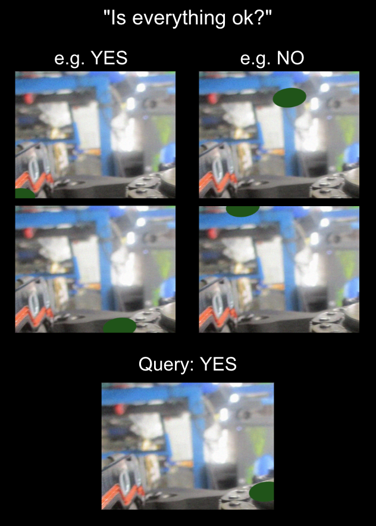

# Learning novel tasks from Visual Demonstrations

Can a VLM learn a novel visual task where the correct answer is not in the query text at all, but only possible to infer from the in-context examples?  For example, people will often ask a fully ambiguous question like "Is everything ok?" expecting the system to learn that the position of a certain object in the scene is sometimes good and sometimes bad, as in:

{: style="display: inline-block; margin: 0 auto; max-width: 300px"}

## Paper

The paper is available on arxiv at [https://arxiv.org/abs/2409.17080](https://arxiv.org/abs/2409.17080).

## Code for generating the dataset

This repository will contain the code used to create the datasets in our paper on learning from visual demonstrations.  Stay tuned!
